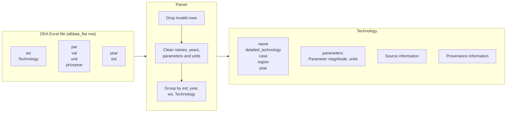

# Danish Energy Agency Parser (v10)

<!--
SPDX-FileCopyrightText: technologydata contributors

SPDX-License-Identifier: MIT

-->

!!! note
    This example refers specifically to **version 10** (`v10`) of the DEA Energy Storage dataset. Details such as file names, sheet structure, and parser behaviour may differ for other versions.

The Danish Energy Agency (DEA) maintains a dataset of techno-economic data for different energy storage technologies.
The data in its raw format is available in PDF and as an Excel file.
We parse the Excel file and extract more than 3000 individual parameters into our data schema and make them available through the package.

The dataset is published by the Danish Energy Agency via [this website](https://ens.dk/media/6589/download) and described in the [accompanying documentation](https://ens.dk/media/6588/download).
The data is licensed CC-BY-4.0.

## Quick start

Load the parsed dataset.
The data ships with the package

```python
from technologydata import DataAccessor

# The bundled catalogues ship inside the installed package.

data_package = DataAccessor(
    data_source="dea_energy_storage",
    version="v10",
).load()

technologies = data_package.technologies
print(len(technologies.technologies))
> 136
```

Inspect the collection as a table:

```python
df = technologies.to_dataframe()
print(df[["detailed_technology", "case", "year"]].head().to_string(index=False))
```

```text
                detailed_technology    case  year
      compressed air energy storage control  2015
         hydrogen storage - caverns control  2015
            hydrogen storage - lohc control  2015
large-scale hot water tanks (steel) control  2015
                   na-nicl2 battery control  2015
```

Select the data for all years of Li-ion utility scale battery in the EU:

```python
batteries = data.technologies.get(
    name="lithium ion battery",
    detailed_technology="utility-scale",
    region="EU",
    case="control",
    # Use regex to match all years from 2000 to 2099
    year="20\\d+",
)

len(batteries)
# 5
```

The technologies are also accessible as a list.
Get the first technology from the list and access one of its parameters (the speciic investment costs):

```python
investment = batteries.technologies[0].parameters["specific investment"]
print(investment)
# 288000.0 EUR_2020 / megawatt_hour
```

## From raw data to parsed output

Each raw row carries one parameter value together with the context that identifies it.
The parser written for `technologydata` cleans and harmonises these fields, then groups the rows into `Technology` objects.
Each technology object is then created based on the group of rows identifying this technology and holds a dictionary of `Parameter` values.



## Deep dive: From raw to parsed data

An example for a speciic row, e.g. row 2335 of Excel file's worksheet `alldata_flat` contains the 2025 specific investment of a utility-scale lithium-ion battery.
It reaches the parsed collection as follows.

| Raw field | Raw value | Parsed field | Parsed value |
|---|---|---|---|
| `ws` | `180 Lithium Ion Battery` | `Technology.name` | `lithium ion battery` |
| `Technology` | `Lithium-ion battery (Utility-scale)` | `Technology.detailed_technology` | `lithium-ion battery (utility-scale)` |
| `year` | `2025` | `Technology.year` | `2025` |
| `est` | `ctrl` | `Technology.case` | `control` |
| — | — | `Technology.region` | `EU`, set by the parser |
| `par` | `Specific investment [MEUR2020/MWh]` | parameter key | `specific investment` |
| `val` | `0.288` | `Parameter.magnitude` | `288000.0` |
| `unit`, `priceyear` | `MEUR/MWh`, `2020` | `Parameter.units` | `EUR_2020 / megawatt_hour` |

Three opinioated transformations are worth following:
The leading three-digit code `180` is stripped from `ws`, the remaining whitespace trimmed and the text lower-cased, which is why the technology is keyed as `lithium ion battery`.
The unit `MEUR/MWh` is rescaled to `EUR/MWh`, multiplying `val` by 1e6, and `priceyear` is folded into the currency, giving the `EUR_2020` form the package uses throughout.

## Parser steps in detail

**Reading.** The `alldata_flat` sheet is read with `pandas.read_excel(..., engine="calamine", dtype=str)`, so every entry starts as a string.

**Validation.** `_drop_invalid_rows()` checks that the required columns are present and drops rows whose `Technology`, `par`, `val` or `year` is missing or empty. It keeps only rows where `year` contains a four-digit year and `val` contains numeric characters without a comparator symbol (`<`, `>`, `≤`, `≥`).

**Cleaning.** Four functions normalise the text fields:

- `_clean_technology_string()` strips leading three-digit codes, trims whitespace and lower-cases, and is applied to `Technology` and `ws`. It turns `151b Hydrogen Storage - LOHC` into `hydrogen storage - lohc`.
- `_clean_parameter_string()` removes leading hyphens and bracketed text, collapses spaces and lower-cases the parameter name.
- `_extract_year()` takes the first digit sequence from `year`, so `Uncertainty (2050)` becomes the integer `2050`.
- `_clean_est_string()` casefolds `est` and expands `ctrl` to `control`.

**Units.** `_standardize_units()` fills in units missing from the source by parameter name, mapping for instance `energy storage capacity for one unit` to `MWh`, and replaces unit strings that pint cannot read, such as `⁰C` to `C` or `m2` to `meter**2`. `Commons.update_unit_with_currency_year()` then appends `priceyear` to currency units, producing the `EUR_2020` form matched by the package's currency pattern `\b(?P<cu_iso3>[A-Z]{3})_(?P<year>\d{4})\b`. `_format_val_number()` parses comma decimal separators and scientific notation variants such as `×10`, converts to float and rounds to `num_digits`.

The parser also applies a small set of fixed corrections:

- `MEUR_2020` and `kEUR_2020`/`KEUR_2020` become `EUR_2020`, with `val` scaled by 1e6 or 1e3.
- Individual unit repairs, such as `mol/s/m/MPa1/2` to `mol/s/m/Pa`, with the value scaled to match.
- Parameter names such as `energy storage capacity for one unit` and `tank volume of example` are normalised to `capacity`.

**Filtering.** `_filter_parameters()` keeps only an allowed set of parameters when `filter_params` is set — `technical lifetime`, `fixed o&m`, `specific investment`, `variable o&m`, `charge efficiency`, `discharge efficiency` and `capacity` — and otherwise returns everything.

**Building the collection.** `_build_technology_collection()` groups the cleaned frame by `est`, `year`, `ws` and `Technology`. Each group becomes one `Technology`, with `name` from `ws`, `detailed_technology` from `Technology`, `region` fixed to `EU`, `case` from `est`, and a dictionary of `Parameter` objects carrying `magnitude`, `units`, `sources` and `provenance`. When `archive_source` is set it builds a `Source` for the dataset, calls `ensure_in_wayback()` and writes `sources.json`; otherwise it reads an existing `sources.json`.

## Regenerate the data

The parsed files shipped with the package are produced by the same public entry point, `DataAccessor.parse()`.

!!! warning "`parse()` writes relative to the working directory"
    Unlike `load()`, the output path is derived from the current working directory, as `<cwd>/src/technologydata/parsers/dea_energy_storage/v10/`, and ignores `data_path`. Run this from the root of a checkout you are willing to modify: it overwrites the files distributed with the package.

```python
from technologydata.parsers.data_accessor import DataAccessor

parser_accessor = DataAccessor(
    data_source="dea_energy_storage",
    version="v10",
)

parser_accessor.parse(
    input_file_name="Technology_datasheet_for_energy_storage.xlsx",
    num_digits=3,
    archive_source=True,
    filter_params=True,
    export_schema=True,
)
```

`parse()` accepts:

- `input_file_name` (str): name of the raw file in `src/technologydata/parsers/raw/`.
- `num_digits` (int, default 4): number of decimals for rounding numeric values.
- `archive_source` (bool, default False): whether to store the source on the Wayback Machine.
- `filter_params` (bool, default False): whether to restrict the output to the allowed parameter set.
- `export_schema` (bool, default False): whether to export the pydantic schemas.

## Outputs

The parser writes `technologies.json` and `sources.json` into `<cwd>/src/technologydata/parsers/dea_energy_storage/v10/`. With `export_schema=True`, the pydantic schemas are written alongside the JSON files as `technologies.schema.json` and, when `archive_source` is set, `sources.schema.json`.
