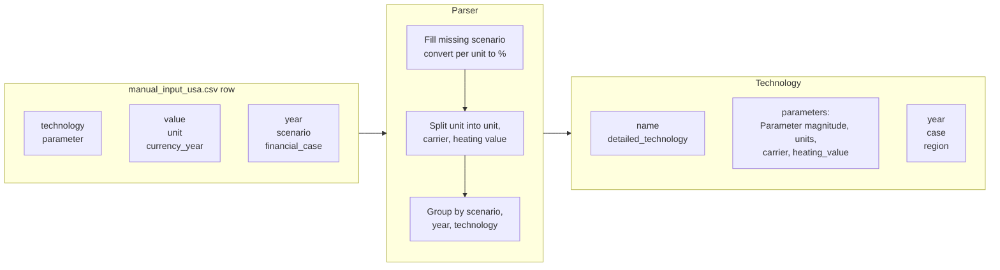

# Manual Input USA Parser (v0.13.4)

<!--
SPDX-FileCopyrightText: technologydata contributors

SPDX-License-Identifier: MIT

-->

!!! note
    This example refers specifically to **version 0.13.4** (`v0134`) of the Manual Input USA dataset.

The Manual Input USA dataset is a manually curated CSV of USA-specific technology parameters. Its 286 rows each hold one parameter record, across the columns `technology`, `parameter`, `year`, `value`, `unit`, `currency_year`, `source`, `further_description`, `financial_case` and `scenario`. The parser in `src/technologydata/parsers/manual_input_usa/` turns them into the schema files `technologies.json` and `sources.json`.

The dataset originates in the [PyPSA technology-data repository](https://github.com/PyPSA/technology-data/blob/v0.13.4/inputs/US/manual_input_usa.csv). A copy is included in the repository at `src/technologydata/parsers/raw/manual_input_usa.csv`.

## Quick start

Load the parsed dataset. The catalogues ship inside the installed package, so `data_path` can be derived from the package location and these snippets run from any working directory.

```python
import pathlib

import technologydata
from technologydata.parsers.data_accessor import DataAccessor

# The bundled catalogues ship inside the installed package.
data = pathlib.Path(technologydata.__file__).parent / "parsers"

data_package = DataAccessor(
    data_source="manual_input_usa",
    version="v0.13.4",
    data_path=data,
).load()

technologies = data_package.technologies
print(len(technologies.technologies))
```

```text
85
```

`load()` also writes `INFO: Data source directory corresponding to version v0.13.4 found.` to standard error.

Inspect the collection as a table:

```python
df = technologies.to_dataframe()
print(df[["detailed_technology", "case", "year"]].head().to_string(index=False))
```

```text
             detailed_technology              case  year
Alkaline electrolyzer large size Advanced - Market  2020
     PEM electrolyzer small size Advanced - Market  2020
                            SOEC Advanced - Market  2020
              direct air capture Advanced - Market  2020
                battery inverter Advanced - Market  2022
```

Read one parameter of one technology:

```python
fischer_tropsch = next(
    t
    for t in technologies.technologies
    if t.name == "Fischer-Tropsch" and t.year == 2020
)
hydrogen_input = fischer_tropsch.parameters["hydrogen-input"]
print(hydrogen_input.magnitude, "|", hydrogen_input.units)
print(hydrogen_input.carrier, "|", hydrogen_input.heating_value)
```

```text
1.43 | dimensionless
hydrogen / fischer_tropsch | lower_heating_value
```

## From raw data to parsed output

Each raw row carries one parameter value together with the context that identifies it. The distinctive step for this dataset is the unit string: entries such as `MWh_H2/MWh_FT` encode a unit, an energy carrier and a heating value in one field, and the parser splits them into three. Rows are then grouped into `Technology` objects.



## A worked row

The `Fischer-Tropsch` / `hydrogen-input` row for 2020 exercises every one of those steps: it has a compound unit, no `currency_year`, and no `scenario`.

| Raw field | Raw value | Parsed field | Parsed value |
|---|---|---|---|
| `technology` | `Fischer-Tropsch` | `Technology.name` | `Fischer-Tropsch` |
| `technology` | `Fischer-Tropsch` | `Technology.detailed_technology` | `Fischer-Tropsch` |
| `year` | `2020` | `Technology.year` | `2020` |
| `scenario` | empty | `Technology.case` | `not_available` |
| — | — | `Technology.region` | `USA`, set by the parser |
| `parameter` | `hydrogen-input` | parameter key | `hydrogen-input` |
| `value` | `1.43` | `Parameter.magnitude` | `1.43` |
| `unit` | `MWh_H2/MWh_FT` | `Parameter.units` | `dimensionless` |
| `unit` | `MWh_H2/MWh_FT` | `Parameter.carrier` | `hydrogen / fischer_tropsch` |
| `unit` | `MWh_H2/MWh_FT` | `Parameter.heating_value` | `lower_heating_value` |
| `further_description` | `0.995 MWh_H2 per output, …` | `Parameter.note` | the same text |

The unit is resolved in two stages, which is why the stored strings differ from the ones the parser looks up. `_extract_units_carriers_heating_value()` maps `MWh_H2/MWh_FT` to the triple `("MWh/MWh", "H2/FT", "LHV")`. Constructing the `Parameter` then resolves each of those through the package's pint registries: `MWh/MWh` cancels to `dimensionless`, while `H2` and `FT` expand to their canonical names via `src/technologydata/utils/carriers.txt`, and `LHV` via `src/technologydata/utils/heating_values.txt`.

## Parser steps in detail

**Reading.** The CSV is read with `pandas.read_csv(..., dtype=str, na_values="None")`, so every entry starts as a string except `value`, which is cast to float.

**Units, carriers and heating values.** `_extract_units_carriers_heating_value()` maps compound unit strings onto a `(unit, carrier, heating_value)` triple through a fixed dictionary, and returns the input unchanged with two `None`s when there is no match. The nine mapped patterns are:

| Input unit | Unit | Carrier | Heating value |
|---|---|---|---|
| `USD_2022/MW_FT` | `USD_2022/MW` | `1/FT` | `1/LHV` |
| `MWh_H2/MWh_FT` | `MWh/MWh` | `H2/FT` | `LHV` |
| `MWh_el/MWh_FT` | `MWh/MWh` | `el/FT` | `LHV` |
| `t_CO2/MWh_FT` | `t/MWh` | `CO2/FT` | `LHV` |
| `USD_2022/kWh_H2` | `USD_2022/kWh` | `1/H2` | `LHV` |
| `MWh_el/MWh_H2` | `MWh/MWh` | `el/H2` | `LHV` |
| `USD_2023/t_CO2/h` | `USD_2023/t/h` | `1/CO2` | none |
| `MWh_el/t_CO2` | `MWh/t` | `el/CO2` | `LHV` |
| `MWh_th/t_CO2` | `MWh/t` | `thermal/CO2` | `LHV` |

These are the values the mapping returns, not the values that end up stored. As shown in the worked row above, `Parameter` resolves them through the pint registries in `src/technologydata/utils/`, so `H2/FT` is stored as `hydrogen / fischer_tropsch` and `LHV` as `lower_heating_value`.

**Other cleaning.** Missing `scenario` entries are filled with `not_available`. Units containing `per unit` are rewritten to `%` and the corresponding `value` multiplied by 100. `Commons.update_unit_with_currency_year()` appends `currency_year` to currency units where present, producing the `USD_2022` form matched by the package's currency pattern `\b(?P<cu_iso3>[A-Z]{3})_(?P<year>\d{4})\b`.

**Building the collection.** `_build_technology_collection()` groups the cleaned frame by `scenario`, `year` and `technology`. Each group becomes one `Technology`, with both `name` and `detailed_technology` taken from `technology`, `region` fixed to `USA`, and a dictionary of `Parameter` objects carrying `magnitude`, `sources` and, where available, `carrier`, `heating_value`, `units` and `note`. The `case` combines the two scenario fields as `"{scenario} - {financial_case}"` when a `financial_case` is present in the group, and is the `scenario` alone otherwise. When `archive_source` is set it builds a `Source` for the dataset, calls `ensure_in_wayback()` and writes `sources.json`; otherwise it reads an existing `sources.json`.

## Regenerate the data

The parsed files shipped with the package are produced by the same public entry point, `DataAccessor.parse()`.

!!! warning "`parse()` writes relative to the working directory"
    Unlike `load()`, the output path is derived from the current working directory, as `<cwd>/src/technologydata/parsers/manual_input_usa/v0.13.4/`, and ignores `data_path`. Run this from the root of a checkout you are willing to modify: it overwrites the files distributed with the package.

```python
from technologydata.parsers.data_accessor import DataAccessor

parser_accessor = DataAccessor(
    data_source="manual_input_usa",
    version="v0.13.4",
)

parser_accessor.parse(
    input_file_name="manual_input_usa.csv",
    num_digits=3,
    archive_source=True,
    export_schema=True,
)
```

`parse()` accepts:

- `input_file_name` (str): name of the raw file in `src/technologydata/parsers/raw/`.
- `num_digits` (int, default 4): number of decimals for rounding numeric values.
- `archive_source` (bool, default False): whether to store the source on the Wayback Machine.
- `filter_params` (bool, default False): accepted for interface compatibility and unused by this parser.
- `export_schema` (bool, default False): whether to export the pydantic schemas.

## Outputs

The parser writes `technologies.json` and `sources.json` into `<cwd>/src/technologydata/parsers/manual_input_usa/v0.13.4/`. With `export_schema=True`, the pydantic schemas are written alongside the JSON files as `technologies.schema.json` and, when `archive_source` is set, `sources.schema.json`.
